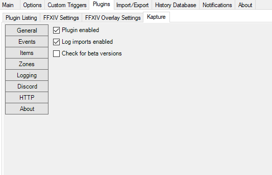

<h1 align="center">
   
   Kapture 
</h1>
<h4 align="center">ACT FFXIV Plugin Loot Tracker.</h4>

  
  
  
  

## Background

Kapture is an ACT FFXIV Loot Tracker plugin to record your loot. You can send loot messages to discord, log them to your desktop, and more.

## Demo

## Key Features

* Track your loot in Final Fantasy XIV.
* Capture drops, obtained items, and rolls.
* Capture your own loot, your party members, or even the whole alliance.
* Filter by zones with presets (e.g. only high-end duties).
* Filter by items with presets (e.g. filter out common items like gil or tomestones).
* Log your loot in a basic log file or get fancier with csv/json.
* Send your loot to your discord with an easy to [setup web hook](https://support.discordapp.com/hc/en-us/articles/228383668-Intro-to-Webhooks) (no discord bot needed).
* Send your loot (enriched with other data) - to your HTTP server.

## How To Install

1. Ensure your ACT and FFXIV ACT Plugin are up-to-date.
2. Download the latest version from the [release](https://github.com/kalilistic/Kapture/releases/latest) page.
3. Copy the Kapture.dll file into your ACT Plugins directory (usually C:\Users\yourname\AppData\Roaming\Advanced Combat Tracker\Plugins).
4. Open ACT and select "Plugins" and then "Plugins Listing".
5. Select browse and select the Kapture.dll.
6. Select "Add/Enable Plugin".
7. Select "Kapture".
8. Select apply.
9. You're good! Now check out the Kapture tab in ACT to customize your settings.

## Software Used

* <a href="https://github.com/EQAditu/AdvancedCombatTracker">Advanced Combat Tracker</a>
* <a href="https://github.com/ravahn/FFXIV_ACT_Plugin">FFXIV_ACT_Plugin</a>
* <a href="https://github.com/kalilistic/Aetherbridge">Aetherbridge</a>
* <a href="https://xivapi.com/docs/Icons">XIVAPI (for repo icon)</a>

## How To Contribute

Feel free to open an issue or submit a PR.