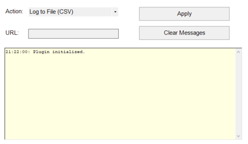
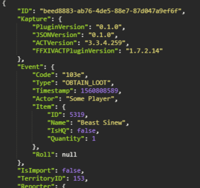

# ACT FFXIV Kapture
**Kapture** is an ACT plugin for FFXIV to capture your loot-related events including drops, rolls, and obtained items. 
You can send them to discord, store them in log files, or send them to a REST endpoint.

#### Screenshots

## Prerequisites
Please ensure the following are installed before using Kapture.
* [Microsoft .NET Framework 4.6.2](https://www.microsoft.com/en-us/download/details.aspx?id=53344)
* [Advanced Combat Tracker](https://advancedcombattracker.com/download.php)
* [FFXIV_ACT_Plugin](https://github.com/ravahn/FFXIV_ACT_Plugin)

## Download
You can download Kapture from the  [release](https://github.com/kalilistic/ACT.FFXIV.Kapture/releases) page.

## Setup
1. Ensure your ACT and FFXIV ACT Plugins are up-to-date.
2. Download the current version from the [release](https://github.com/kalilistic/ACT.FFXIV.Kapture/releases) page.
3. [Unblock](https://blogs.msdn.microsoft.com/delay/p/unblockingdownloadedfile/) the zip file.
4. Extract the zip file into your ACT installation folder.
5. Open ACT and select "Plugins" and then "Plugins Listing".
6. Select browse and select the Kapture.dll.
7. Select "Add/Enable Plugin".
8. Select "Kapture".
9. Select your desired option (more details below) and URL if applicable.
10. Select apply.

## Using Kapture

### Actions
* Send to Discord Webhook - Send simple loot message to a [discord web hook](https://support.discordapp.com/hc/en-us/articles/228383668-Intro-to-Webhooks).
* Log to File (Simple) - Record simple loot message to log file.
* Log to File (CSV) - Record all captured loot data to csv file.
* Log to File (JSON) - Record all captured loot data to log file in json format.  
* Send to HTTP Server - POST all captured loot events to a REST endpoint.

### Logging
* All event logs are stored in the KaptureLogs directory in your ACT installation directory.
* Errors will be saved to Kapture.log in the KaptureLogs directory (please let me know!).

### Data
* Kapture meta data (e.g. plugin version)
* Event (e.g. type, player name)
* Item data (ID, name, isHQ, quantity)
* TerritoryID
* Reporter (ID, Name, WorldID, ClassJobID)
* Party Members (ID, Name, WorldID, ClassJobID)

### Event Types
* ADD_LOOT - Loot is added to the loot list.
* GREED_LOOT - Player rolls Greed on an item.
* NEED_LOOT - Player rolls Need on an item.
* OBTAIN_LOOT - Player obtains an item.
* LOST_LOOT - No one rolls and an item drops to the floor.

### Limitations
* TerritoryID, Reporter, and Party Members are not available on imports.
* Only English is supported at this time.

## Software Used
* [Saint Coinach](https://github.com/ufx/SaintCoinach)

 ## Roadmap
 * Streamline build/release process.
 * Add support for new 2.x FFXIV ACT plugin.
 * Add support for additional loot events (e.g. buy/sell items).
 * Add support for filters (e.g. zone, item types).
 * Consider support for other non-combat events beyond loot.
 
 ## Report Issue
You can suggest improvements or report bugs [here](https://github.com/kalilistic/ACT.FFXIV.Kapture/issues).

 ## Disclaimer
Use of this program is at your own risk. Square Enix does not permit the use of any third party tools, even those which do not modify the game.