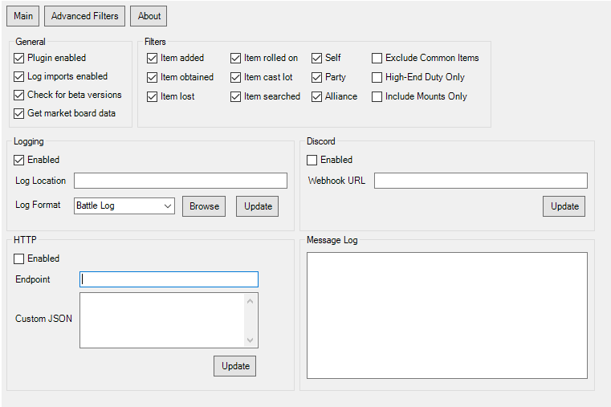
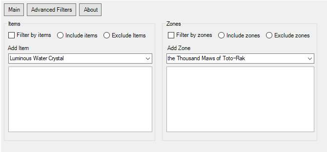
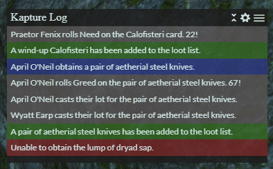
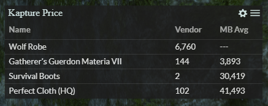

<h1 align="center">
   
   Kapture 
</h1>
<h4 align="center">ACT FFXIV Plugin Loot Tracker.</h4>

  
    
  
  

## Background

Kapture is an ACT FFXIV Loot Tracker plugin to record your loot. You can send loot messages to discord, show them in an overlay, and more. Support for English, Japanese, German, and French.

## Preview

 
 

## Key Features

* Track your loot in Final Fantasy XIV.
* Capture drops, obtained items, rolls, and more.
* Capture your own loot, your party members, or even the whole alliance.
* Filter by zones with presets (e.g. only high-end duties).
* Filter by items with presets (e.g. filter out common items like gil or tomestones).
* Log your loot in a basic log file or get fancier with csv/json.
* Send your loot to your discord with an easy to [setup web hook](https://support.discordapp.com/hc/en-us/articles/228383668-Intro-to-Webhooks) (no discord bot needed).
* Send your loot (enriched with other data) - to your HTTP server.
* Use an overlay to see more data including Marketboard prices.

## How To Install

1. Ensure your ACT, FFXIV ACT Plugin, and Overlay Plugin are up-to-date.
2. Download the latest version from the [release](https://github.com/kalilistic/Kapture/releases/latest) page.
3. Copy the Kapture.dll file into your ACT Plugins directory (usually C:\Users\yourname\AppData\Roaming\Advanced Combat Tracker\Plugins).
4. Open ACT and select "Plugins" and then "Plugins Listing".
5. Select browse and select the Kapture.dll.
6. Select "Add/Enable Plugin".
7. Select "Kapture".
8. Select apply.
9. Restart ACT (you should be prompted to).
10. You're good! Now check out the Kapture tab in ACT to customize your settings.

## How to Use a Kapture Overlay

1. Open Overlay plugin tab.
2. Select "New" button.
3. Select "Preset" dropdown list.
4. Select your desired Kapture overlay.
5. Click OK.

**Important notes**
* Restart ACT after installing/updating before trying to use an Overlay.
* Ensure the data you want in the overlay is enabled in the Kapture plugin tab.

**Overlays**
* <a href="https://github.com/kalilistic/kapture-log-overlay">Log Overlay</a>
* <a href="https://github.com/kalilistic/kapture-price-overlay">Price Check</a>

**Build your Own**
* Read <a href="https://ngld.github.io/OverlayPlugin/devs/">ngld's overlay development guide</a>.
* Check out the example directory to see the JSON data and a minimal overlay example.
* When it's done, reach out and we can add it to the Preset list.

## Software Used

* <a href="https://github.com/EQAditu/AdvancedCombatTracker">Advanced Combat Tracker</a>
* <a href="https://github.com/ravahn/FFXIV_ACT_Plugin">FFXIV_ACT_Plugin</a>
* <a href="https://github.com/ngld/OverlayPlugin">ngld's OverlayPlugin</a>
* <a href="https://github.com/kalilistic/Aetherbridge">Aetherbridge</a>
* <a href="https://github.com/Universalis-FFXIV/Universalis">Universalis</a>
* <a href="https://xivapi.com/docs/Icons">XIVAPI</a>

## Troubleshooting
* **No loot data is getting captured.** 
  Under the FFXIV Settings tab, ensure the "Hide Chat Log" option is unchecked.

* **Missing data for my party or alliance.** 
  Under the FFXIV Settings tab, ensure the Parse Filter is set to "None".

* **Could not load file or assembly OverlayPlugin.Common...** 
  Ensure you are using the latest version of ngld's overlay plugin and is above Kapture in your plugin list.
  
* **The overlay window is too small / big.** 
  You can click and drag the bottom right corner to resize the window.
  
* **The overlay text is too small / big.** 
  In your overlay plugin tab, select the overlay, and then Advanced. You'll find a "Zoom" slider you can adjust to fit your preference.

* **I don't see any Kapture overlays in the Overlay Plugin presets.** 
  Restart ACT and try again.
  
* **My problem isn't listed here.** 
  Reach out on discord or raise a github issue.
